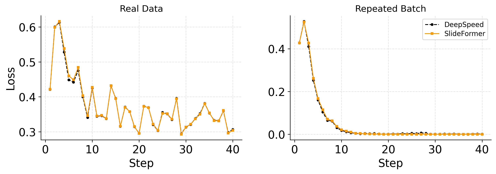
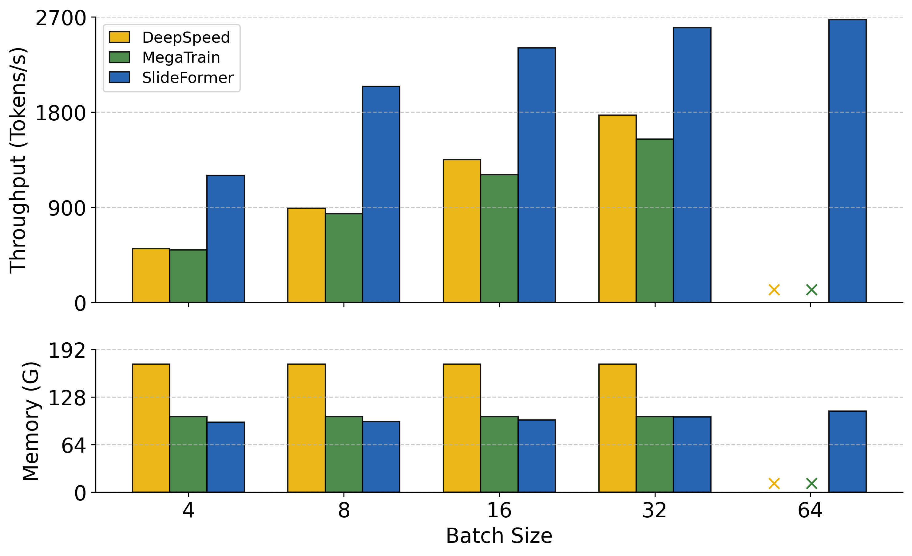
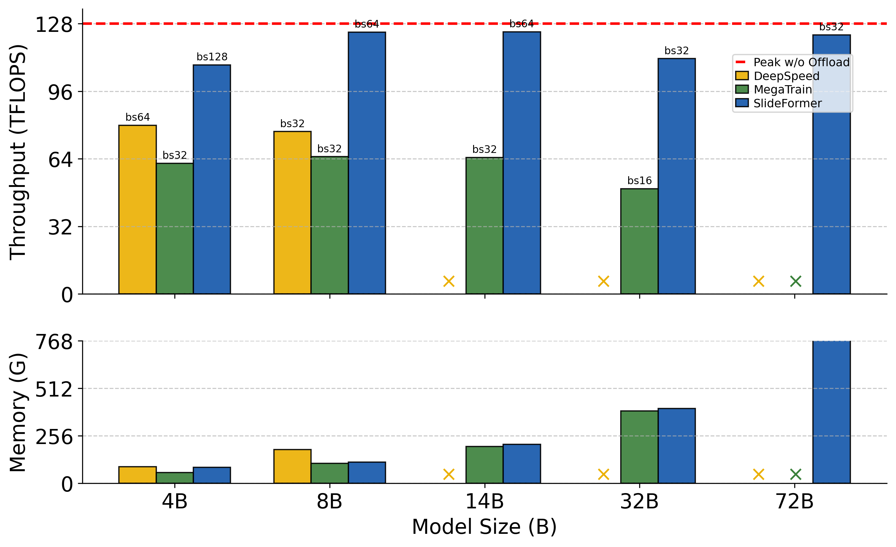
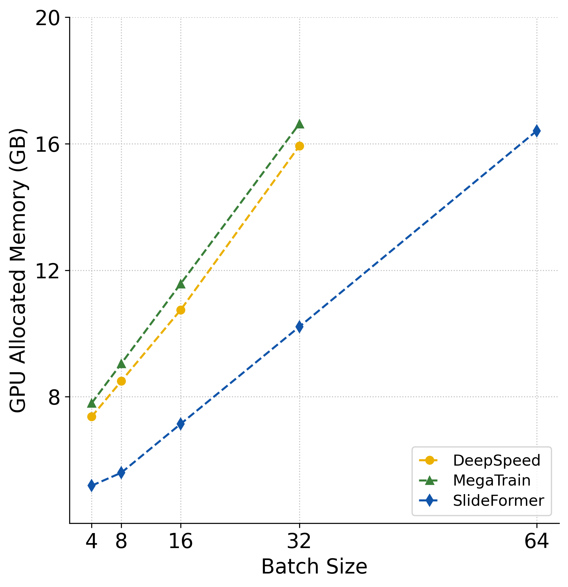
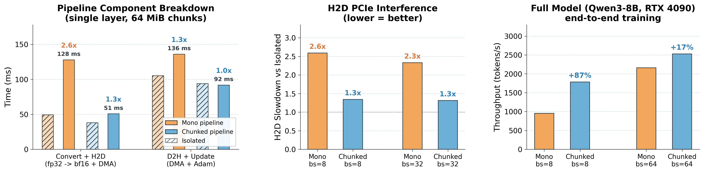

# SlideFormer

<div align="center">

<h3>An Efficient Heterogeneous Co-Design for Fine-Tuning on a Single GPU</h3>

<p>
  <a href="https://arxiv.org/pdf/2603.16428"></a>
  <a href="https://doi.org/10.1145/3770743.3804125"></a>
  <a href="https://63dac.conference-program.com/presentation/?id=RESEARCH1286&sess=sess110"></a>
  <a href="https://github.com/RegiaYoung/SlideFormer/stargazers"></a>
  <a href="LICENSE"></a>
</p>

<p>
  <a href="#installation">Installation</a> |
  <a href="#quick-start">Quick Start</a> |
  <a href="#benchmarking">Benchmarking</a> |
  <a href="#supported-models">Supported Models</a> |
  <a href="#citation">Citation</a>
</p>
</div>

**SlideFormer** is a PyTorch-based heterogeneous runtime for full-parameter
fine-tuning on a single GPU. It co-designs layer-sliding execution,
heterogeneous memory management, and asynchronous transfer/compute pipelines
across GPU memory, CPU RAM, and optional NVMe storage. Only a compact active
layer window is materialized on the GPU, while persistent training states are
kept in CPU memory and cross-tier data movement is carefully scheduled
throughout execution.

In our evaluation, SlideFormer achieves
**1.40×–6.27× higher throughput** than related offloading baselines, reduces
peak GPU memory by up to **50%** and peak CPU memory by up to **40%**,
supports up to **8× larger batch sizes**, and enables full-parameter
fine-tuning of **100B+ models** on a single commodity GPU.

If this repository is useful to your work, please consider starring it.

## News

- **2026.06**: We released SlideFormer with expanded model compatibility,
  reproducibility scripts, and a new
  [fine-grained chunked pipeline](#fine-grained-chunked-overlap). A multi-GPU
  extension of SlideFormer's heterogeneous runtime is under
  active development and will be documented soon.
- **2026.03**: SlideFormer was accepted to DAC 2026. The conference presentation
  page is available [here](https://63dac.conference-program.com/presentation/?id=RESEARCH1286&sess=sess110), and the paper is available on
  [arXiv](https://arxiv.org/pdf/2603.16428).
- **Early 2025**: The initial SlideFormer system was developed and evaluated;
  subsequent development has focused on system-level optimization.

## Highlights

- **Layer-sliding execution**: keeps only a compact active layer window on the
  GPU, allowing full-parameter fine-tuning of models that exceed GPU memory
  capacity.

- **Lightweight asynchronous engine**: overlaps GPU computation with CPU
  optimizer updates, FP32-to-BF16 conversion and H2D parameter transfers, D2H
  gradient movement, activation offload/prefetch, and optional NVMe I/O.

- **Heterogeneous memory hierarchy**: coordinates GPU memory, CPU RAM, and
  optional local NVMe storage to reduce memory pressure while preserving
  full-parameter mixed-precision training semantics.

- **Memory-efficient implementation**: uses pre-allocated GPU cache units,
  layer-shared host buffers, and a layer-wise CPU LayerAdam path to reduce
  allocation overhead and peak GPU/CPU memory usage.

## Installation

SlideFormer is designed for single-GPU machines with sufficient CPU memory.
The exact memory requirement depends on the model size, sequence length, batch
size, optimizer state, and offload configuration.

From our evaluation sweep, a practical estimate is
**about 12 GB CPU RAM per 1B parameters +
batch-dependent activation/buffer overhead**. NVMe optimizer/activation offload
can further reduce the CPU-memory requirement at the cost of lower throughput.

```bash
git clone https://github.com/RegiaYoung/SlideFormer.git
cd SlideFormer
conda env create -f environment.yml
conda activate slideformer
```

Core dependencies are
[`torch`](https://docs.pytorch.org/docs/stable/index.html),
[`transformers`](https://huggingface.co/docs/transformers/en/index), and
[`datasets`](https://huggingface.co/docs/datasets/en/index). Since the core
runtime is mostly torch-native, SlideFormer can also run on AMD/ROCm GPUs with a
compatible [PyTorch/ROCm stack](https://pytorch.org/get-started/locally/).
Optional dependencies for acceleration/offload are
[`flash-attn`](https://github.com/Dao-AILab/flash-attention),
[`liger-kernel`](https://github.com/linkedin/Liger-Kernel), and
[`tensornvme`](https://github.com/hpcaitech/TensorNVMe); the code falls back
when they are not available. We recommend installing all optional dependencies
to match the reported performance.

## Quick Start

Run a dummy-data end-to-end sanity check:

```bash
python scripts/main_dummy.py \
  --model_path /path/to/Llama-3.1-8B-Instruct \
  --seq_len 1024 \
  --batch_size 64
```

On multi-NUMA machines, binding the process to the GPU's NUMA node can improve
CPU-GPU bandwidth:

```bash
numactl --cpunodebind=0 --membind=0 python scripts/main_dummy.py
```

Useful options:

| Option | Description |
|---|---|
| `--model_path` | Local path or HuggingFace model ID |
| `--seq_len` | Sequence length |
| `--batch_size` | Per-step batch size |
| `--epochs` | Number of training epochs |
| `--attn_implementation` | `flash_attention_2` or `sdpa` |
| `--ac_offload_nvme` | Offload saved activations to NVMe |
| `--nvme_offload_fraction` | Optimizer-state NVMe offload fraction |
| `--offload_dir` | Directory used when NVMe offload is enabled |

## Real Data Example

`scripts/main_real.py` provides a real fine-tuning example on
[QizhiPei/MathFusionQA](https://huggingface.co/datasets/QizhiPei/MathFusionQA).

```bash
python scripts/main_real.py \
  --model_path /path/to/Llama-3.1-8B-Instruct \
  --seq_len 4096 \
  --batch_size 16 \
  --epochs 1 \
  --output_dir ./mathfusion-ft-results
```

The script saves the trained model, tokenizer, loss curve, and loss CSV to
`--output_dir`.

## Correctness Validation

SlideFormer tracks a DeepSpeed ZeRO-3 CPU-offload reference on both 40 distinct
real-data batches and a repeated-batch overfit probe.



## Benchmarking

Single benchmark run:

```bash
python scripts/main_bench.py \
  --model_path /path/to/Llama-3.1-8B-Instruct \
  --seq_len 1024 \
  --batch_size 64 \
  --warm_step 3 \
  --test_step 10 \
  --result_file ./outputs/bench.csv
```

Sweep over configured models and batch sizes:

```bash
bash scripts/bench.sh
```

For reproducibility, baseline implementations and adapted configs are collected
under `bench/`, including [DeepSpeed](https://github.com/microsoft/DeepSpeed),
[ColossalAI](https://github.com/hpcaitech/ColossalAI),
[MegaTrain](https://github.com/DLYuanGod/MegaTrain), and
[LoHan](https://github.com/RC4ML/LoHan). The supplemental figures below add a
MegaTrain comparison alongside the paper baselines.

<table>
  <tr>
    <td align="center" width="38%">
      <br>
      <sub><b>(a)</b> Batch-size scaling and CPU memory for Llama-3.1-8B on RTX 4090.</sub>
    </td>
    <td align="center" width="38%">
      <br>
      <sub><b>(b)</b> Model-size scaling and CPU memory for Qwen3 models on RTX 4090.</sub>
    </td>
    <td align="center" width="24%">
      <br>
      <sub><b>(c)</b> GPU allocated memory vs. batch size for Llama-3.1-8B.</sub>
    </td>
  </tr>
</table>


> **Note:** For fairness, all evaluated systems use the same workload
> and enable the same fused kernels unless a framework already provides an
> equivalent implementation. SlideFormer and all baselines except MegaTrain
> follow mixed-precision training semantics with BF16 compute, FP32 master
> parameters, and FP32 optimizer states. In the official MegaTrain single-GPU
> path, CPU-resident model parameters are loaded and updated in BF16.
> Its CPU-memory footprints are therefore shown for reference only.

## Technical Updates

### Fine-grained Chunked Overlap

The 2026.06 release adds a chunked asynchronous transfer/update pipeline that
splits long FP32-to-BF16 conversion, H2D parameter movement, D2H gradient
return, and CPU Adam update into smaller overlapped segments. This reduces
exposed transfer/update time under pipeline contention and improves Qwen3-8B
single-GPU throughput, especially at small batch sizes.



## Supported Models

- [Qwen2, Qwen2.5, and Qwen3](https://huggingface.co/Qwen)
- [Llama 3, 3.1, 3.2, and 3.3](https://huggingface.co/meta-llama)
- [Mistral models](https://huggingface.co/mistralai)
- Other [HuggingFace decoder-only Transformers](https://huggingface.co/docs/transformers/model_doc/auto#transformers.AutoModelForCausalLM)

Some model families may require light adapter changes for full compatibility.
We will continue expanding tested model support.

## Repository Layout

```text
SlideFormer/
├── offload_transformer.py      # Runtime engine and scheduling
├── transformer_layer.py        # Layer wrappers and CPU-GPU transfers
├── sliding_checkpoint.py       # Activation offload and prefetch
├── optimizer/                  # Layer-wise CPU Adam optimizer
├── utils/                      # Datasets, metrics, and monitor helpers
├── scripts/                    # Train, bench, and profile entries
├── bench/                      # Baselines and reproducibility artifacts
└── environment.yml             # Conda environment
```

## Citation

If you use SlideFormer, its code, or its design ideas in your research, please
cite our DAC 2026 paper.

- Paper: [An Efficient Heterogeneous Co-Design for Fine-Tuning on a Single GPU](https://arxiv.org/pdf/2603.16428)
- DAC 2026 presentation: [63rd ACM/IEEE Design Automation Conference](https://63dac.conference-program.com/presentation/?id=RESEARCH1286&sess=sess110)
- DOI: [10.1145/3770743.3804125](https://doi.org/10.1145/3770743.3804125)
- ISBN: `979-8-4007-2254-7`

```bibtex
@misc{yang2026efficientheterogeneouscodesignfinetuning,
      title={An Efficient Heterogeneous Co-Design for Fine-Tuning on a Single GPU},
      author={Ruijia Yang and Zeyi Wen},
      year={2026},
      eprint={2603.16428},
      archivePrefix={arXiv},
      primaryClass={cs.DC},
      url={https://arxiv.org/abs/2603.16428},
}
```

## License

This project is released under the [Apache-2.0 License](LICENSE). See
[NOTICE](NOTICE) for attribution and bundled third-party software information.
